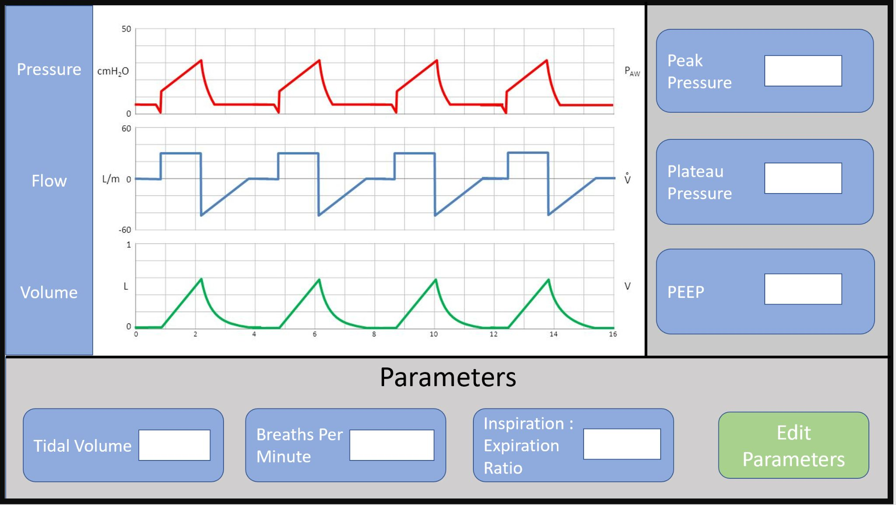

# VentCU
> A radically accessible, affordable, and producible ventilator. 

## VentCU has not been clinically tested. It is NOT approved for medical use.

## What is VentCU?
In response to the initial explosion in demand for ventilators caused by the global COVID-19 crisis, VentCU was developed as an intermediary manual ventilation device for clinical use.  Designed in collaboration with medical professionals and skilled engineers, VentCU is positioned as a **radically affordable** device able to be **assembled with no prior experience and no specialized tools**.  *Constructed entirely from consumer-off-the-shelf parts*, available in the hundreds to thousands in a matter of days, hospital technicians and maker enthusiasts alike will be able to construct VentCU with nothing more than an instruction manual, an Allen key, a pair of scissors, and a soldering iron.

The critical demand for ventilators that sparked VentCU’s conception has thankfully subsided since the beginning of the COVID-19 crisis.  However, VentCU continues as an area of research to be used in further development of affordable, easily manufacturable ventilators should another surge for ventilators emerge or for communities already lacking access to proper ventilation devices.  **As such, VentCU is completely open-source.**

## [VentCU Website](https://coda.io/@maker/ventcu) 
Check out our website (https://coda.io/@maker/ventcu) for detailed technical, BOM, and contact information.
Also, feel free to share our work on social media!

## Repository Structure
- Media contains images of the VentCU, including renders and profile views.
- Mechanics contains STEP files of the main assembly and its subcomponents. 
- Electronics contains simple image and Eagle schematics, along with relevant component documentation.
- Software contains the VentCU control system in its native file structure. 

## Mechanics
A stable release main assembly can be found within the `mechanics` directory. A viewable, online CAD model with complete relationships can viewed at this [Onshape link](https://cad.onshape.com/documents/f7de46ca7dc3a8d28aa71883/w/2f9839ab30d7aa3f0e55734c/e/351b5eba45a0f5e74e63c1ba).

A user manual and specification sheet can be found in the stable release directory in the `mechanics` directory and at this [Google Docs link](https://docs.google.com/document/d/146-ZcDFsmwu9b4q7zNh3ngux9tSg6TSOEBYOS_3Alh4/edit?usp=sharing)

## Electronics

## Software
VentCU runs currently on a Raspberry Pi 3 B+, Python 3, and PyQT application stack, relying on a touchscreen interface to view and control the device. We have mocked up our main control, homing, and UI state diagrams below:
### Main Control

### Homing

### Mock UI

Detailed information on configuration, testing, and troubleshooting is forthcoming.

## Repository Changelog
Newest on top.
9/12/2020: v0.1-alpha: preliminary alpha release for first public publishing
### bbwtb
