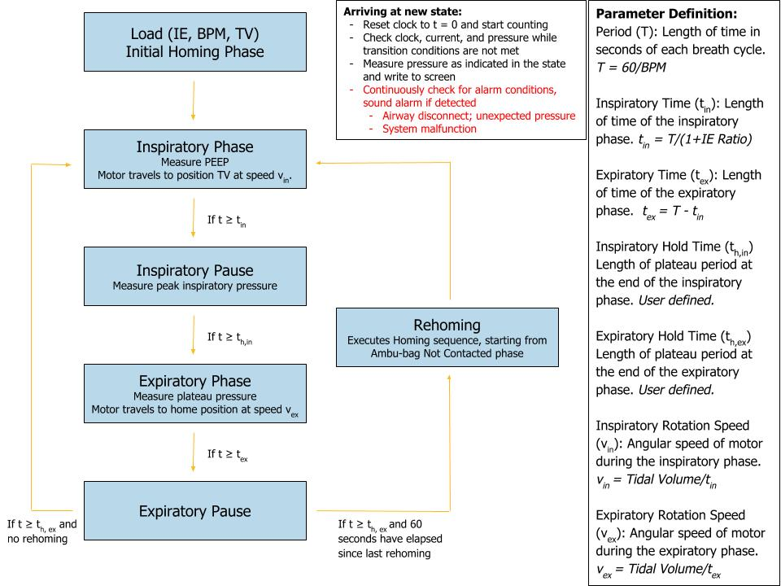
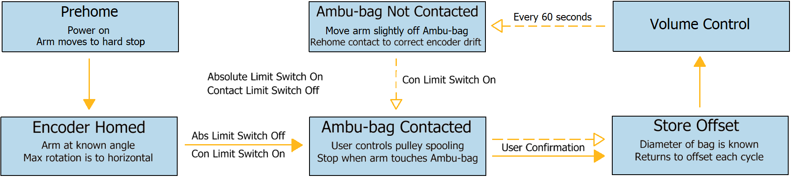

# VentCU Control System
> `version 0.1-alpha`

## Overview
VentCU runs currently on a Raspberry Pi 3 B+, Python 3, and PyQT application stack, relying on a touchscreen interface to view and control the device. We have mocked up our main control, homing, and UI state diagrams below:
### Main Control

### Homing

## Init New State:
check clock, current, pressure while transition conditions are not met
set time elapsed to 0
start clock
measure, write pressure as indicated in screen
continuously check for alarm conditions

## Volume Control:
goto init new state
query user for IE, BPM, TV
goto Initial Homing Phase
inspiratory phase:
goto init new state
store pressure reading 
store p_curr - p_prev
if time elapsed >= inspiratory time
continue
drive stepper motor
inspiratory pause:
goto init new state
stop driving stepper motor
hold stepper motor
store peak pressure reading
if time elapsed >= inspiratory hold time
continue
expiratory phase:
goto init new state
store plateau pressure
drive stepper motor back to stored offset position
if time elapsed >= expiratory time
expiratory pause:
goto init new state
if time elapsed >= expiratory hold time && no rehoming
goto Inspiratory Phase
if time elapsed >= expiratory hold time && 60 seconds since rehoming
goto Rehoming

## Initial Homing Phase:
drive stepper motor until abs limit switch 1
store max rotation value
drive stepper motor until con limit switch 1
 if in initial homing phase
query user for confirmation
store offset b/w abs and con
store diameter of bag
return

## Rehoming:
drive stepper motor until con limit switch 0
drive stepper motor until con limit switch 1
store offset b/w abs and con
store diameter of bag
goto inspiratory phase

## Software Changelog
09/12/2020: v0.1-alpha: preliminary alpha release for first public publishing
09/03/2020: v0.0-alpha: stable alpha for committee demo